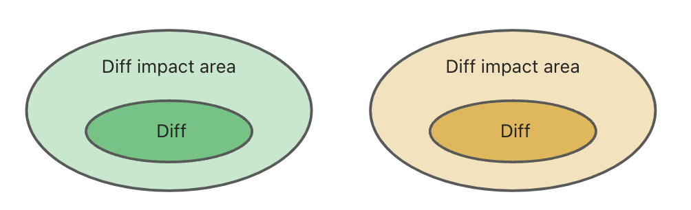
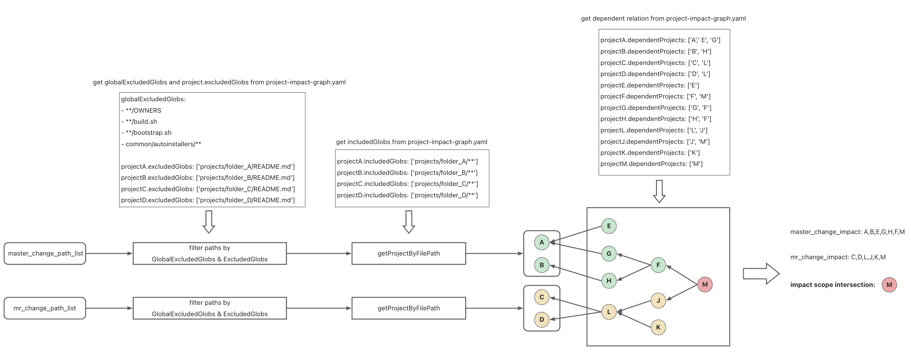

## Background

When you need to merge an Merge Request(or Pull Request), if the target branch has changed, you need to rebase the source branch of the MR to keep in sync with the latest target branch. This process will cause changes to the MR source branch, and these changes are not verified by CI, so CI needs to be retriggered for verification. The Merge Queue provided by gitlab hosts the "Rebase + rerun CI" process in an automated way.

<p align="center">
  
</p>

As shown in the figure above, the merge base of a Merge Request is B1. The orange area is the changes of the MR and has been verified by CI. When the MR is to be merged into the master, the master branch has already had new changes. Before the MR is merged, the green and orange areas need to be merged into a whole through rebase to re-trigger CI. Only after passing the new CI verification can MR be merged into the master.

In Monorepo, when we modify the code of a certain projectA in MR and pass the CI verification, the scope of this CI verification is projectA itself and its impact area, where the impact area represents other apps/libs that directly or indirectly reference projectA.
From this, we can make a hypothesis, as shown in the figure below, if there is no intersection between the "green impact area" and the "orange impact area", as long as MR passes the CI verification, there is no need to retrigger CI after rebase master, which can improve merging efficiency and reduce resource costs.

<p align="center">
  
</p>

So how to identify whether there is an intersection between the impact areas of different changes?

-   This document aims to define a file format to represent dependencies between projects in monorepo.
-   The file format can be used to determine whether there is an intersection between two sets of change files.

(Note: project generally refers to an independent app or lib. In the front-end field, it usually consists of a package.json file describing meta information, and code functions. There may be differences in other fields)

## Design Principles

| Principle                               | Description                                                                                                                                                                 |
| --------------------------------------- | --------------------------------------------------------------------------------------------------------------------------------------------------------------------------- |
| Avoid git conflicts as much as possible | In Monorepo, every project dependency change will lead to changes in this file. When multiple MRs have modified the file, conflicts should be avoided as much as possible.  |
| Common to multiple technical fields     | Code integration occurs in the R&D process of each technical field, so file design should avoid being strongly related to the technical solution in a certain field.        |
| Simple and easy to use                  | Code integration is a frequent event. It is necessary to pay attention to the parsing efficiency and usage complexity of the file. It should be as easy to use as possible. |

## File format design

### Option 1

-   File Name：project-impact-graph.yaml
-   Description: only describe project dependencies
-   Fields：
    -   projectName: the name of a project or module
    -   includedGlobs: a glob list, representing a project scope, used to match each file path in MR change
    -   dependentProjects: A set of project names that directly depend on the key project

```yaml
- projectName: 'A'
  includedGlobs:
      - 'projects/A/**'
  dependentProjects:
      - 'A'
      - 'B'
      - 'C'
- projectName: 'D'
  includedGlobs:
      - projects/D/**
  dependentProjects:
      - 'D'
```

### Option 2

-   File Name：project-impact-graph.yaml
-   Description: based on Option 1, some business information is added to support filtering specified file paths.
-   Fields：
    -   globalExcludedGlobs: used to identify paths that should be ignored before matching
    -   projects:
        -   Key: project name
        -   Value:
            -   includedGlobs: a glob list, representing a project scope, used to match each file path in MR change
            -   excludedGlobs: a project-level glob list, used to identify paths to ignore before matching
            -   dependentProjects: A set of project names that directly depend on the key project

```yaml
globalExcludedGlobs:
    - '**/OWNERS'
    - '**/build.sh'
    - '**/bootstrap.sh'
    - 'common/autoinstallers/**'
projects:
    'A':
        includedGlobs:
            - 'projects/A/**'
        excludedGlobs:
            - 'projects/A/README.md'
        dependentProjects:
            - 'A'
            - 'B'
            - 'C'
    'D':
        includedGlobs:
            - 'projects/D/**'
        excludedGlobs:
            - 'projects/D/README.md'
        dependentProjects:
            - 'D'
```

-   **globalExcludedGlobs** and **excludedGlobs** are defined in **<monorepo_root>/.mergequeueignore** and **<project_root>/.mergequeueignore** respectively
    -   <monorepo_root>/.mergequeueignore
        ```yaml
        **/OWNERS
        **/build.sh
        **/bootstrap.sh
        common/autoinstallers/**
        ```
    -   <project_root>/.mergequeueignore
        ```yaml
        projects/A/README.md
        ```

## How to generate the project-impact-graph.yaml file

Taking a monorepo managed by [rush.js](https://rushstack.io/) as an example, each project is in a unique folder. When the project dependencies in Monorepo change, the files need to be automatically regenerated
The steps to generate the yaml file are as follows:

1. Get **globalExcludedGlobs** from `<monorepo_root>/.mergequeueignore`
2. Use the [rush tool](https://github.com/microsoft/rushstack) to get the <project_root> of each project, and then generate **includedGlobs** based on the <project_root>
3. Get **excludedGlobs** from `<project_root>/.mergequeueignore`
4. Use the [rush tool](https://github.com/microsoft/rushstack) to get the dependents of each project
5. Generate project-impact-graph.yaml

## How to use the project-impact-graph.yaml file

<p align="center">
  
</p>

When an MR is submitted to the Merge Queue, the Merge Queue will perform the following steps:

1. Request and parse the latest `project-impact-graph.yaml`
2. Request the change file list `mr_change_path_list`, `master_change_path_list` of MR and master
3. Filter paths in two lists based on **globalExcludedGlobs** and **excludedGlobs** defined in `project-impact-graph.yaml`
4. Match the projects defined in `project-impact-graph.yaml` one by one according to `mr_change_path_list` and `project.includedGlobs`
5. Recursively find all dependent projects of each matched project in real time (directly and indirectly), and merge all the values of dependentProjects fields to get `mr_change_impact`
6. Run step4 and step5 again for `master_change_path_list` to get `master_change_impact`
7. Calculate whether there is intersection between `mr_change_impact` and `master_change_impact`
8. If there is an intersection, MR needs to retrigger CI check after rebase master, otherwise skip CI check

## Issues

1. Why use glob to represent folder/project?

Usage: Glob patterns are primarily used in file systems to filter filenames or directories. They are used in Unix shell commands and many programming languages like Python, JavaScript, etc.

Complexity: Glob patterns are simpler to use and understand. They typically include wildcard characters like **\*** (matches any number of any characters). In monorepo, we can use **project/\*\*** to represent all file paths under a project

2. Why use includedGlobs to represent one project instead of includedGlob？

In a monorepo managed by rush, a project can be represented by a folder, but there is no guarantee that all package management tools adopt the same strategy. A project may have multiple different folders. In order to ensure file scalability, `project-impact-graph.yaml` uses a glob list to represent the project

3. The relation of **includedGlobs** and **excludedGlobs**

Project level excludeGlobs should not be allowed to affect public files by default, so excludedGlobs needs to be a subset of includedGlobs in a certain project. The maintainer of each project can only configure the file paths within the project that need to be ignored. In addition, public files can only be configured by the maintainer of the Monorepo repository in globalExcludedGlobs

4. Priority of **.gitignore**, **globalExcludedGlobs** and **excludedGlobs**

If a file is in the scope of **.gitignore**, it can not appear in Merge Request and will not appear in **project-impact-graph.yaml**

If a file is filtered by **globalExcludedGlobs**, then it will never have a chance to match **excludedGlobs**

For detailed usage logic, please refer to the following two parts: How to generate the **project-impact-graph.yaml** file and How to use the **project-impact-graph.yaml** file

5. How to determine the latest **project-impact-graph.yaml**

Users may have modified dependencies in MR, and project-impact-graph.yaml has changed. Merge Queue sticks to using the latest file. There are several scenarios:

-   Neither MR nor master has modified project-impact-graph.yaml: Merge Queue requests the file from merge base commit
-   Only MR modified project-impact-graph.yaml: Merge Queue requests the file from MR change
-   Only Master modified project-impact-graph.yaml: Merge Queue requests the file from master change
-   MR and Master modified project-impact-graph.yaml at the same time: Merge Queue uses two project-impact-graph.yaml files from MR and master to calculate dependent relations separately

## Demo

Assume that Monorepo has projects **A, B, B_subProject, C,..., M**. Their dependency relations are as follows:

<p align="center">
  
</p>

There are some cases defined in the `src/test/index.test.ts` file. After cloning the repository, you can execute the following command to get a deeper understanding

```
pnpm install
pnpm test
```

## Performance Test

We simulate creating a Monorepo and generate a dependency DAG for it. Assume that each project is a node and the dependency relation between any two projects is a directed edge. We also provide a generateDAG function that supports customizing the number of generated nodes and edges for a DAG. You can modify the `testConfig` in `src/performance/index.ts` to customize your own test complexity, then execute the following command to start performance testing

```
pnpm install
pnpm test:performance
```

### Performance report：

-   Testing environment:
    -   8 \* [Intel(R) Xeon(R) Gold 5118 CPU @ 2.30GHz]
    -   MemTotal: 40GB
    -   Node, Typescript

| nodeCount | edgeCount | pathCountA | pathCountB | executeTime |
| --------- | --------- | ---------- | ---------- | ----------- |
| 1000      | 5000      | 1          | 1          | 0.489s      |
| 1000      | 5000      | 10         | 10         | 0.425s      |
| 1000      | 5000      | 100        | 100        | 0.448s      |
| 1000      | 5000      | 1000       | 1000       | 0.845s      |
| 2000      | 10000     | 1          | 1          | 0.913s      |
| 2000      | 10000     | 10         | 10         | 0.936s      |
| 2000      | 10000     | 100        | 100        | 1.072s      |
| 2000      | 10000     | 1000       | 1000       | 1.776s      |
| 3000      | 100000    | 1          | 1          | 9.46s       |
| 3000      | 100000    | 10         | 10         | 10.533s     |
| 3000      | 100000    | 100        | 100        | 11.029s     |
| 3000      | 100000    | 1000       | 1000       | 11.984s     |
